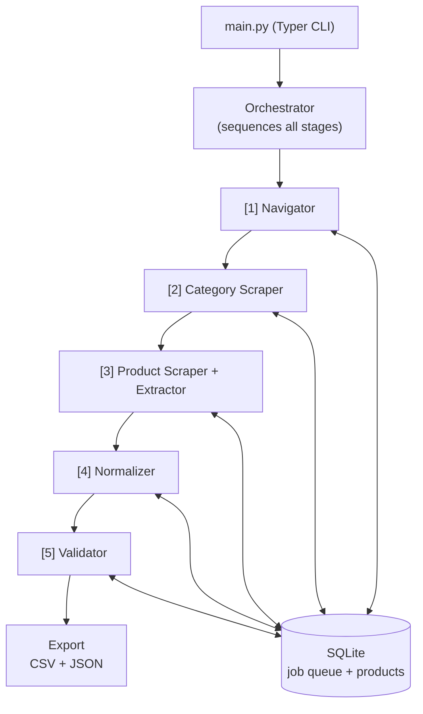

# AI Agent for Product Scraping and Structured Catalog Extraction

An AI-powered ETL pipeline that extracts structured product catalog data from Safco Dental Supply (safcodental.com). Built as a proof-of-concept for Frontier Dental's competitive intelligence workflow.

## Architecture Overview



Each agent is independent and communicates only through SQLite. Killing and restarting the pipeline resumes from the last completed stage.

### Agent Details

| Stage | Agent | LLM | Tools | Responsibility |
| ----- | ----- | --- | ----- | -------------- |
| 1 | **Navigator** | No | `httpx`, `xml.etree` | Parses `catalog.xml` / `products.xml` sitemaps; filters to target categories; populates the job queue |
| 2 | **Category Scraper** | No | `httpx`, `BeautifulSoup` | Fetches category pages via HTTP; extracts product URLs and partial metadata from JSON-LD structured data |
| 3 | **Product Scraper** | No | `Playwright`, `tenacity` | Renders JS-heavy product pages with a headless browser; retries on timeout; passes raw HTML to the Extractor |
| 3 | **Extractor** | Fallback only | `BeautifulSoup` (primary), `LiteLLM` (fallback) | CSS selector extraction is primary; LLM `tool_use` activates only when selectors return empty |
| 4 | **Normalizer** | Yes | `LiteLLM` | Normalizes `unit_size` into a canonical form (e.g. `"bx/100"` → `"100/box"`) and infers `specifications` attributes from context — reasoning that `"X-small"` is a `Size`, `"#15C"` is a `Shape`, `"Latex"` is a `Material`, etc. |
| 5 | **Validator** | Yes | `LiteLLM` | Ensures specification attribute idempotency across LLM batches — detects when the same attribute was labelled differently (e.g. `"Shape"` vs `"Blade"`) and normalizes to one canonical key per attribute. Falls back to most-frequent-key selection when no API key is set. |

## Why This Approach

**Agent-based architecture** -- Each stage is an independent agent with a single responsibility. Agents communicate through a shared SQLite database rather than direct calls, which makes the pipeline resumable (kill and restart from where it left off) and observable (query the DB to see progress at any time).

**CSS selectors as primary extraction** -- For the known Magento/Hyva DOM structure, CSS selectors are fast, free, and deterministic. The LLM fallback only activates when selectors return empty results, keeping the hot path cost-free.

**Sitemap-first discovery** -- Rather than spidering the site, the pipeline reads `catalog.xml` and `products.xml` directly. This is faster, respects `robots.txt`, and gives a complete URL inventory without pagination concerns.

**LLM usage decisions** -- AI is used only where deterministic code would be brittle or unmaintainable:

| Agent | LLM Used? | Rationale |
| ----- | --------- | --------- |
| Navigator | No | Sitemap XML has a fixed schema; `xml.etree` parsing is deterministic and free |
| Category Scraper | No | JSON-LD structured data is machine-readable by design; no ambiguity to resolve |
| Product Scraper | No | Page rendering is a mechanical browser operation; no reasoning required |
| Extractor | Fallback only | CSS selectors cover ~95% of pages; LLM only fires when the DOM returns nothing, avoiding cost on the hot path |
| Normalizer | Yes | Two tasks that both require reasoning: (1) unit size strings (`"bx/100"`, `"per box of 100"`, `"2.5ml/vial"`) are too varied for regex; (2) specifications require the LLM to infer what an attribute *is* from context — e.g. recognising `"X-small"` as `Size`, `"#15C"` as `Shape`, `"Latex"` as `Material` — rather than just parsing a value |
| Validator | Hybrid | The Normalizer LLM is not deterministic — it may label the same attribute `"Shape"` in one batch and `"Blade"` in another. The Validator ensures idempotency: union-find detects keys that are mutually exclusive across variants of the same product (a structural signal they occupy the same attribute slot), then the LLM confirms whether they are true aliases and picks one canonical name, guaranteeing consistent keys across the full dataset |

## Setup and Execution

### Prerequisites

- Python 3.11+
- An OpenRouter API key (for LLM steps)

### Installation

```bash
# Clone the repository
git clone github.com/AlexPerrin/AI-Agent-for-Product-Scraping-and-Structured-Catalog-Extraction-POC/edit/main/README.md
cd AI-Agent-for-Product-Scraping-and-Structured-Catalog-Extraction-POC

# Create virtual environment
python -m venv venv
source venv/bin/activate  # Linux/Mac
# or: venv\Scripts\activate  # Windows

# Install dependencies
pip install -r requirements.txt

# Install Playwright browser
playwright install chromium

# Configure environment
cp .env.example .env
# Edit .env and add your OPENROUTER_API_KEY
```

### Running the Pipeline

```bash
# Full pipeline run
python main.py run

# Fresh start (clears all existing data)
python main.py run --reset

# Override target categories
python main.py run --categories sutures-surgical-products --categories gloves

# Skip browser rendering (only run discovery + category scraping)
python main.py run --skip-browser

# Export only (no scraping, just generate CSV/JSON from existing data)
python main.py run --export-only

# Check pipeline status
python main.py status

# Re-run normalizer on already-extracted data and export
python main.py normalize

# Re-run validator (spec key harmonization) on normalized data and export
python main.py validate

# Export existing data
python main.py export
```

### Running Without an API Key

The pipeline works without an OpenRouter API key -- the extractor fallback and normalizer LLM steps are skipped (defaults are kept), and the validator falls back to deterministic most-frequent-key selection. The CSS selector extraction path and all other deterministic stages run normally.

## Output Schema

One row per orderable variant (SKU). Both CSV and JSON exports use this schema:

```json
{
  "product_group_name": "Wire glove box holder",
  "product_name": "Wire glove box holder, double 11\"W x 10.5\"H x 4\"D",
  "brand": "Unimed",
  "item_number": "6220102",
  "manufacturer_number": "BHDH004040",
  "category_hierarchy": ["Dental Supplies", "Dental Exam Gloves", "Glove Holder"],
  "product_group_url": "https://www.safcodental.com/product/wire-glove-box-holder",
  "price": {"1": "21.49"},
  "unit_size": "1",
  "specifications": {"Capacity": "Double (holds 2 boxes)", "Dimensions": "11\"W x 10.5\"H x 4\"D"},
  "availability": "In stock",
  "description": "Three size options to hold 2, 3 or 4 glove boxes...",
  "image_urls": ["https://www.safcodental.com/media/catalog/product/d/r/drvcd_lc.jpg"],
  "scraped_at": "2026-03-17T18:42:00.654385",
  "extraction_method": "css-selector",
  "validation_status": "valid",
  "validation_notes": null
}
```

**Price field**: A dict mapping quantity tier to price. Single-price items: `{"1": "36.99"}`. Volume pricing: `{"1": "36.99", "6": "32.99", "12": "29.99"}`.

**Specifications field**: A JSON object of distinguishing attributes for the variant (size, color, shape, material, dimensions, etc.). Empty object `{}` when no variant-level attributes exist.

**CSV format**: The CSV flattens complex fields -- `price` becomes `Qty 1: $36.99 | Qty 6: $32.99`, `specifications` is serialized as a JSON string, lists become pipe-separated strings.

## Limitations

1. **No proxy rotation.** Requests come from a single IP. High-volume runs may trigger rate limiting.

2. **Playwright is slow.** Rendering JS-heavy Magento pages takes 2-5 seconds each vs ~100ms for static HTTP. The POC scope (two categories) is manageable; full-site crawls need distributed browser workers.

3. **LLM fallback adds cost.** If CSS selectors degrade across many pages (e.g., after a site redesign), LLM calls become expensive. The `extraction_method` metric provides early warning.

4. **No image downloading.** Image URLs are stored, not the images themselves.

5. **Category membership is sitemap-inferred.** Products are assigned to categories based on sitemap discovery. Cross-listed products only get their first category association.

6. **Single-process execution.** The pipeline runs in one process with async concurrency. Production scale requires distributed workers.

## Failure Handling

| Failure Mode | How It Is Handled |
| ------------ | ----------------- |
| HTTP 404 on category page | Job marked `skipped_404`, logged, pipeline continues |
| HTTP error / timeout | Retried 3 times with exponential backoff (1s, 2s, 4s via tenacity) |
| Playwright navigation timeout | Retried 2 times, then job marked `tier2_failed` with error details |
| CSS selectors return empty | Automatic fallback to LLM extraction |
| LLM API error (normalizer) | Logged, batch skipped, pipeline continues with next batch |
| LLM returns unparseable JSON | Logged, batch marked with defaults, pipeline continues |
| LLM rate limit | Exponential backoff retry (up to 6 attempts: 15s, 30s, 60s, 120s, 240s, 480s) |
| LLM API error (validator) | Falls back to deterministic most-frequent-key selection for that product group |
| No API key configured | LLM steps skipped gracefully with warnings; normalizer skips normalization, validator uses deterministic fallback |
| Pipeline killed mid-run | Restart picks up from last checkpoint (each job has status in SQLite) |
| Duplicate products | `UNIQUE` constraint on `safco_item_number`; upserts update existing records |

## How to Scale to Full-Site Crawling

1. **Remove category filtering** -- Set `TARGET_CATEGORIES` to all category slugs or remove the filter entirely in the Navigator agent.

2. **Distributed browser rendering** -- Replace the single Playwright process with a Playwright cluster or Browserless.io pool. The semaphore-based concurrency model already supports this pattern.

3. **Replace SQLite with PostgreSQL** -- Add proper indexing to the products database and use connection pooling (asyncpg) to support concurrent writers across distributed workers.

4. **Implement the job queue with Kafka** -- Decouple the job queue from the products database entirely. Each pipeline stage becomes a Kafka consumer group, publishing completed work as events for the next stage. This enables independent scaling of each stage, persistent replay, and dead-letter handling without coupling job state to the product store.

5. **Integrate structured logging with an observability platform** -- The pipeline already uses `structlog` with structured key-value output. Wire this into Datadog or Grafana to build dashboards and alerts for pipeline performance (throughput, latency per stage, retry rates) and data quality (LLM fallback rate, spec key corrections, extraction failures).

6. **Schedule with Airflow or cron** -- Run differential scrapes (only reprocess products whose content hash changed) on a regular schedule.

7. **Add proxy rotation** -- Configure rotating proxies and user agents to distribute request load across IPs.

8. **Increase rate limits** -- Tune `REQUEST_DELAY` and `BROWSER_CONCURRENCY` based on observed rate limiting behavior.

## How to Monitor Data Quality

1. **LLM fallback rate** -- Track the ratio of `extraction_method="llm-fallback"` records. A rising rate signals CSS selector degradation (site DOM changed). Run `python main.py status` to see current counts.

2. **Spec key harmonization counts** -- The validator logs `specs_fixed` (number of records whose spec keys were renamed for consistency). A high count after a re-run signals the normalizer is producing inconsistent keys, likely due to LLM drift.

3. **Known-page regression tests** -- Maintain a set of 10-20 known product pages with expected output. Run extraction against them after each deploy and alert if results diverge.

4. **Structured logging** -- All pipeline stages use `structlog` with structured key-value output. Ingest logs into Datadog, Grafana, or similar for dashboards and alerting.

5. **Database queries** -- The SQLite database is the source of truth. Query it directly to audit specific records, check job queue health, or investigate extraction failures:

```bash
# Count by extraction method
sqlite3 frontier_dental.db "SELECT extraction_method, COUNT(*) FROM products GROUP BY extraction_method"

# Find LLM fallback records
sqlite3 frontier_dental.db "SELECT item_number, product_name FROM products WHERE extraction_method='llm-fallback'"

# Check failed jobs
sqlite3 frontier_dental.db "SELECT url, error_msg FROM jobs WHERE status='tier2_failed'"

# Check spec key variety across a product group
sqlite3 frontier_dental.db "SELECT product_name, specifications FROM products WHERE product_group_name='Latex Examination Gloves'"
```
